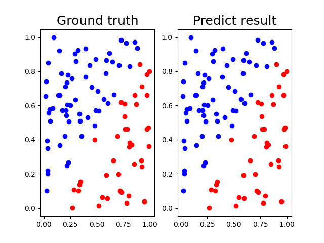
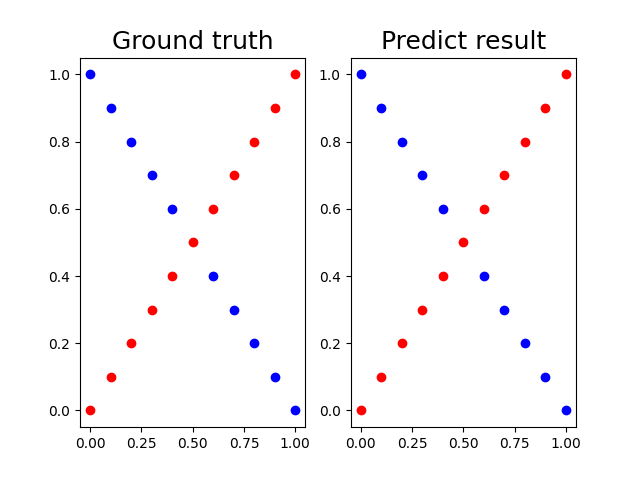

# Lab 1
## Requirements
1. Implement simple neural networks with two hidden layers.
2. Each hidden layer needs to contain at least one transformation (CNN,
Linear … ) and one activate function ( Sigmoid, tanh….).
3. You must use backpropagation in this neural network and can only use
Numpy and other python standard libraries to implement.
## Datasets
###  Linear

### XOR

## Methods
- 在實作類神經網路時，要隨時進清楚整個流程：
    - 1.將input餵進去
    - 2.進行forward得到output
    - 3.使用output和ground turth計算loss
    - 4.使用loss進行backward
    - 5.最後由算出來的backward根據optimizer更新Network的weight。
- 在實作方面，我將主要架構拆為兩個Class: Layer, Network
    - 不管是Layer和Network，都有4個主要步驟：Generate, forward, backward, update。
    - 基本上我都在Layer的部分將數學式寫完，也就是一層的Layer接收到input要如何進行forward、backward和update。剩下的Network其實就是不斷呼叫Layer中的功能而已。
    - 要將全部寫在一起也可以，但在backward會比較複雜容易混亂。
- 此次作業加分題中的Activation和Optimizer比較容易我都有實現，Covolution layer由於比較麻煩分數又沒很多，我覺得性價比不高就沒做了。
    - 比較需要特別注意的是由於此次任務是二元分類，因此最後一層的Activation function一定要是Sigmoid，否則的話就必須更改label中的條件式(因為原先是以0.5作為邊界，但如果不是Sigmoid的話輸出不一定介於0到1之間，使用0.5就不一定合理)。
- 另外我有額外寫Scheduler，寫起來很容易只需要更改lr即可。
## Demo
- 1.跑一次模型看一下loss跟accuracy(如果怕出事可以setseed)，可能會要解釋程式碼
- 2.為什麼更新weight是用-而非+
    - 因為梯度方向問題，我們算出來的梯度方向是向上的，如果要尋找loss的最低點，就要加個負號
- 3.LR在幹嘛
    - 調整每次更新的幅度，太大可能造成模型學習震盪且無法收斂至最低點。太小可能造成模型收斂緩慢且可能掉入區域極小值逃不出來。